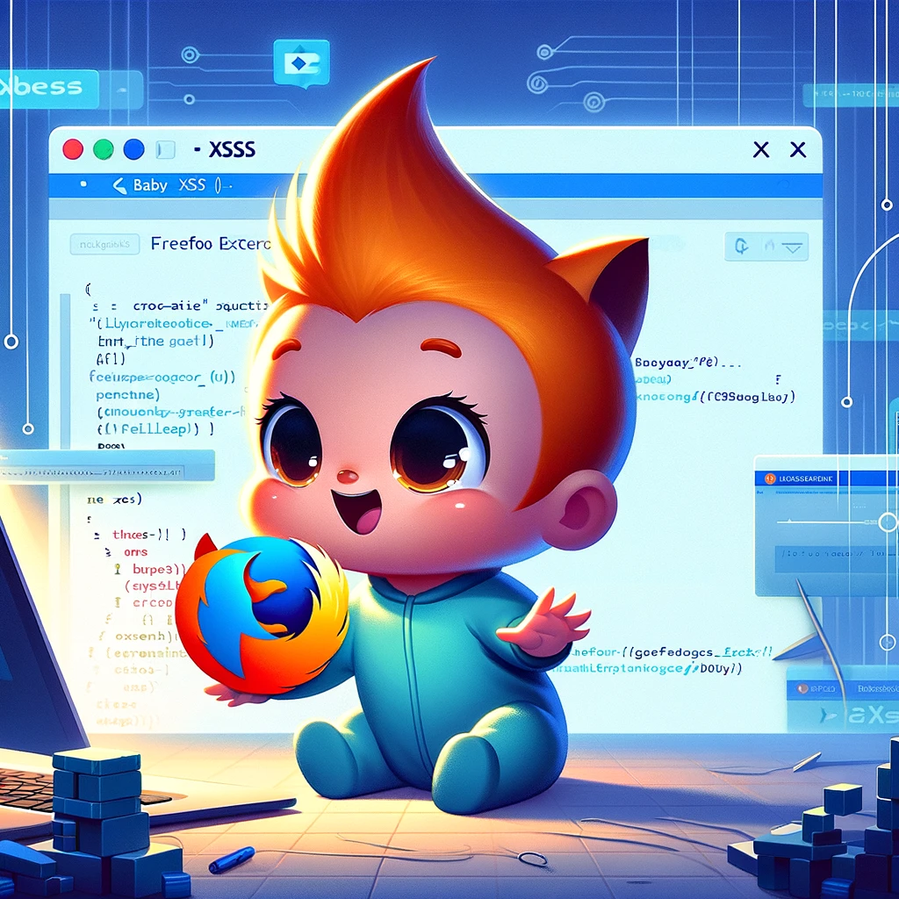

# Baby XSS Mozzila Extension
 

   
    
  </a>
   
  

     
    <a href="https://addons.mozilla.org/en-US/firefox/addon/baby-xss/"><strong>Download and Install »</strong></a>
     
    <a href="https://rezaalieir">About Me</a>  

  

## Overview

Baby XSS is a powerful yet user-friendly Mozilla extension designed to streamline the process of detecting Cross-Site Scripting (XSS) vulnerabilities. With an intuitive interface and a simple two-click mechanism, Baby XSS enables users, from beginners to experienced security professionals, to effortlessly conduct XSS vulnerability tests on their websites.

## Features

- **Ease of Use**: Conduct XSS vulnerability tests with just two mouse clicks.
- **User-Friendly Interface**: A clean, intuitive interface ensures a seamless testing experience.
- **Compatibility**: Designed to integrate smoothly with Mozilla browsers.

## Getting Started

### Installation

1. Visit the Baby XSS extension page on the Mozilla Add-ons store.
2. Click on the "Add to Firefox" button to install the extension.
3. Once installed, the Baby XSS icon will appear in your browser's extension toolbar.

## Contributing

We welcome contributions from the community! If you'd like to contribute to the Baby XSS project, please follow these steps:

1. Fork the repository.
2. Create a new branch for your feature or fix.
3. Commit your changes.
4. Push your branch and open a new pull request.

## Support

If you encounter any issues or have questions regarding the Baby XSS extension, please file an issue on the GitHub repository, and we'll make sure to address it.

## Acknowledgements

A special thanks to all contributors and users of Baby XSS. Your support and feedback are invaluable to the continuous improvement of this tool.
